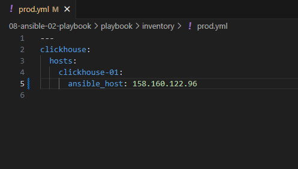
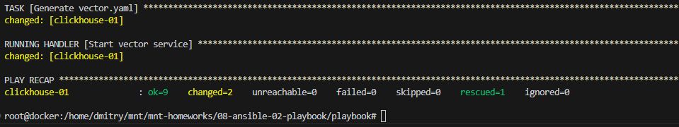
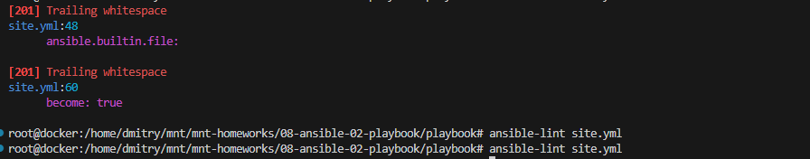
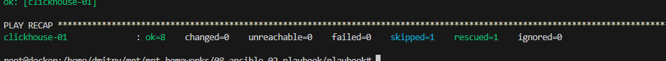
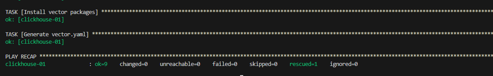
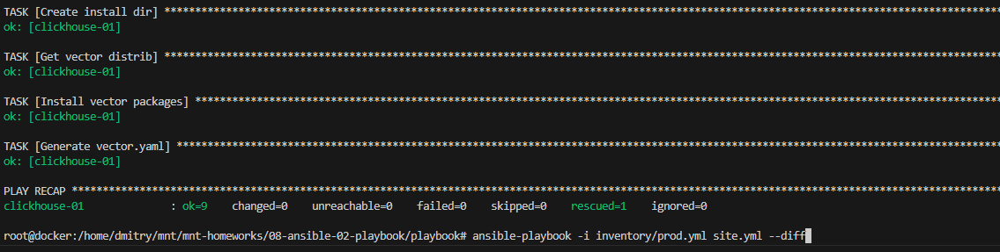

# Домашнее задание к занятию 2 «Работа с Playbook»

## Подготовка к выполнению

1. * Необязательно. Изучите, что такое [ClickHouse](https://www.youtube.com/watch?v=fjTNS2zkeBs) и [Vector](https://www.youtube.com/watch?v=CgEhyffisLY).
2. Создайте свой публичный репозиторий на GitHub с произвольным именем или используйте старый.
3. Скачайте [Playbook](./playbook/) из репозитория с домашним заданием и перенесите его в свой репозиторий.
4. Подготовьте хосты в соответствии с группами из предподготовленного playbook.

## Основная часть

1. Подготовьте свой inventory-файл `prod.yml`.



2. Допишите playbook: нужно сделать ещё один play, который устанавливает и настраивает [vector](https://vector.dev). Конфигурация vector должна деплоиться через template файл jinja2. От вас не требуется использовать все возможности шаблонизатора, просто вставьте стандартный конфиг в template файл. Информация по шаблонам по [ссылке](https://www.dmosk.ru/instruktions.php?object=ansible-nginx-install). не забудьте сделать handler на перезапуск vector в случае изменения конфигурации!

```
- name: Install Vector
  hosts: clickhouse
  handlers:
    - name: Start vector service
      become: true
      ansible.builtin.service:
        name: vector
        state: restarted
  tasks:
    - name: Create install dir
      ansible.builtin.file: 
        path: "{{ vector_install_dir }}"
        state: directory
      become: true
    - name: Get vector distrib
      ansible.builtin.get_url:
        url: "https://packages.timber.io/vector/{{ vector_version }}/vector-0.35.0-1.x86_64.rpm"
        dest: "{{ vector_install_dir }}/vector-0.35.0-1.x86_64.rpm"
      become: true
    - name: Install vector packages
      ansible.builtin.yum:
        name: "{{ vector_install_dir }}/vector-0.35.0-1.x86_64.rpm"
      become: true  
      notify: Start vector service
    - name: Generate vector.yaml
      template: src=vector.yaml.j2 dest={{ vector_config }}
      become: true
      notify: Start vector service
```
Поменял конфигурацию и затестил handler - работает



3. При создании tasks рекомендую использовать модули: `get_url`, `template`, `unarchive`, `file`.
4. Tasks должны: скачать дистрибутив нужной версии, выполнить распаковку в выбранную директорию, установить vector.
5. Запустите `ansible-lint site.yml` и исправьте ошибки, если они есть.

```
Пробелы убрал
```



6. Попробуйте запустить playbook на этом окружении с флагом `--check`.



7. Запустите playbook на `prod.yml` окружении с флагом `--diff`. Убедитесь, что изменения на системе произведены.



8. Повторно запустите playbook с флагом `--diff` и убедитесь, что playbook идемпотентен.



9. Подготовьте README.md-файл по своему playbook. В нём должно быть описано: что делает playbook, какие у него есть параметры и теги. Пример качественной документации ansible playbook по [ссылке](https://github.com/opensearch-project/ansible-playbook). Так же приложите скриншоты выполнения заданий №5-8
10. Готовый playbook выложите в свой репозиторий, поставьте тег `08-ansible-02-playbook` на фиксирующий коммит, в ответ предоставьте ссылку на него.
https://github.com/Dmitrywh1/mnt-homeworks/blob/08-ansible-02-playbook/08-ansible-02-playbook/playbook/readme.md
---

### Как оформить решение задания

Выполненное домашнее задание пришлите в виде ссылки на .md-файл в вашем репозитории.

---
