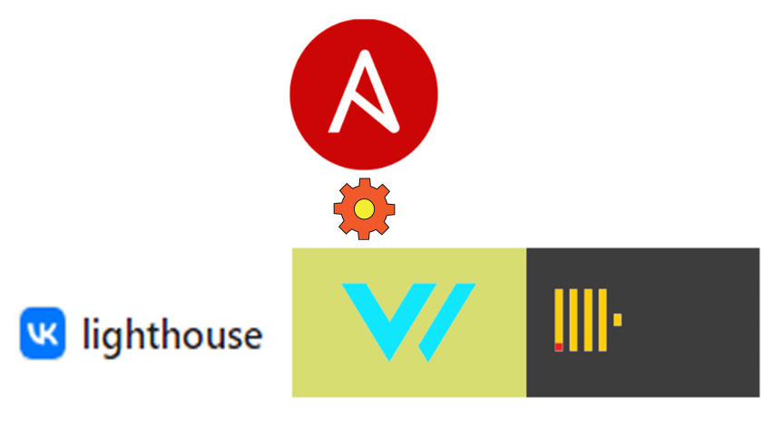

Clickhouse x Vector x vk_lighthouse ansible-playbook
=====================

Репозиторий для 3 домашнего задания в рамках курса `SHDEVOPS-2`

##### Версия 
`1.0`

Синопсис
=====================

Playbook устанавливает [Clickhouse](https://clickhouse.com/), [Vector](https://vector.dev/), [Lighthouse](https://github.com/VKCOM/lighthouse), Nginx на трех распределенных ВМ.

Используются следующие модули:
- `get_url` - скачивание rpm пакетов с удаленных ресурсов
- `git` - клонирование репозитория lighthouse
- `yum` - установка скачанных пакетов
- `command` - создание БД и таблицы в clickhouse
- `file` - создание директории, куда помещаются установочные пакеты 
- конфигурация для Vector создается с помощью `template`
- включены `handlers` для перезагрузки сервисов в случае изменений конфигурации

Установка
=====================

##### Предварительные условия
- ***Установленный `Ansible`***
- ***Подготовленная ВМ `(CentOs, RHEL, Fedora)` с доступом по ssh для выполнения Playbook***

##### Процесс

1. Склонировать проект
2. Перейти в каталог с `site.yml`
3. Выполнить команду `ansible-playbook -i inventory/prod.yml site.yml` ( При необходимости можно добавить флаг `-vvv` для подробного вывода процеса исполннеия playbook)

Приминение
=====================

После выполнения playbook заходим на `http://<адрес вашей ВМ с lighthouse>/#http://<адрес ВМ с Clickhouse>:8123/?user=default`

Выполняем запрос к таблице с логами:

`select * from nginxdb.access_logs`

В результате получаем логи запросов, когда кто-то обращается к `nginx`, который в нашем случае установлен на машине с `Vector`

Поддержка
=====================

Если у Вас возникла сложность по мере установки - можно написать на почту поддержки morgotq@gmail.com :)

