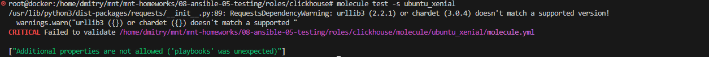
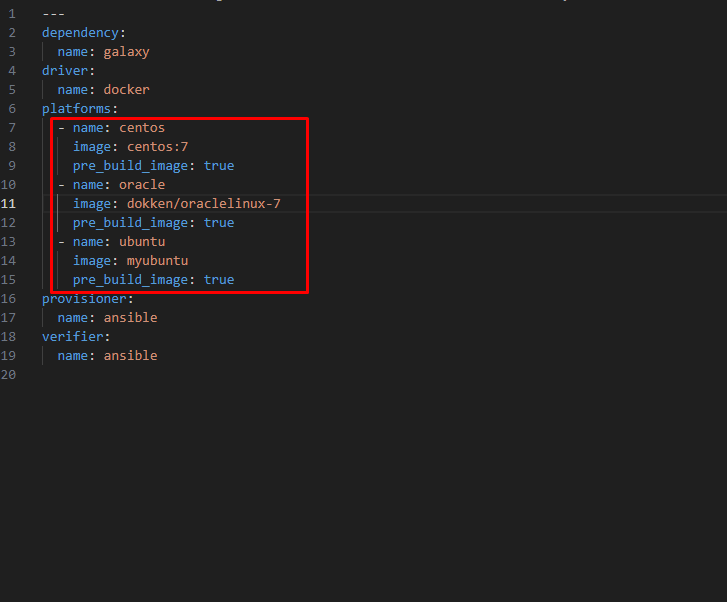
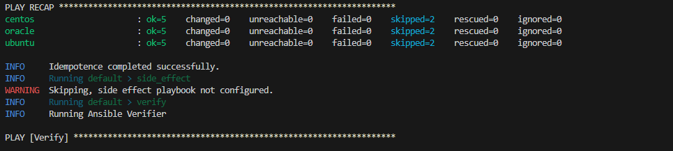
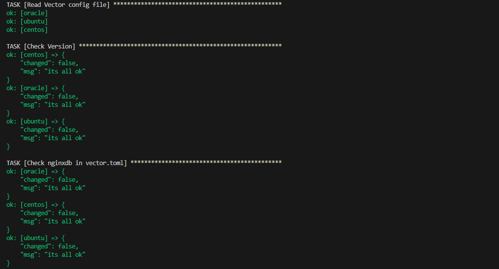

# Домашнее задание к занятию 5 «Тестирование roles»

## Подготовка к выполнению

1. Установите molecule и его драйвера: `pip3 install "molecule molecule_docker molecule_podman`.
2. Выполните `docker pull aragast/netology:latest` —  это образ с podman, tox и несколькими пайтонами (3.7 и 3.9) внутри.

## Основная часть

Ваша цель — настроить тестирование ваших ролей. 

Задача — сделать сценарии тестирования для vector. 

Ожидаемый результат — все сценарии успешно проходят тестирование ролей.

### Molecule

1. Запустите  `molecule test -s ubuntu_xenial` (или с любым другим сценарием, не имеет значения) внутри корневой директории clickhouse-role, посмотрите на вывод команды. Данная команда может отработать с ошибками или не отработать вовсе, это нормально. Наша цель - посмотреть как другие в реальном мире используют молекулу И из чего может состоять сценарий тестирования.



2. Перейдите в каталог с ролью vector-role и создайте сценарий тестирования по умолчанию при помощи `molecule init scenario --driver-name docker`.
3. Добавьте несколько разных дистрибутивов (oraclelinux:8, ubuntu:latest) для инстансов и протестируйте роль, исправьте найденные ошибки, если они есть.

<details>
  <summary>Поправил таски для того, чтобы отрабатывали на разных осях, не только rpm-based системах</summary>
  
```
- name: Create install dir
  ansible.builtin.file:
    path: "{{ vector_install_dir }}"
    state: directory

- name: install on rpm based
  block:
    - name: Get vector distrib
      ansible.builtin.get_url:
        url: "https://packages.timber.io/vector/{{ vector_version }}/vector-{{ vector_version }}-1.x86_64.rpm"
        dest: "{{ vector_install_dir }}/vector.rpm"
        validate_certs: no
    - name: Install vector packages
      ansible.builtin.yum:
        name: "{{ vector_install_dir }}/vector.rpm"
        allow_downgrade: yes
  when: ansible_pkg_mgr == "yum"

- name: install on deb based
  block:
    - name: Get vector distrib
      ansible.builtin.get_url:
        url: "https://packages.timber.io/vector/0.35.0/vector_0.35.0-1_amd64.deb"
        dest: "{{ vector_install_dir }}/vector.deb"
        validate_certs: no
    - name: Install vector packages
      ansible.builtin.apt:
        deb: "{{ vector_install_dir }}/vector.deb"
  when: ansible_pkg_mgr == "apt"

- name: Generate vector.toml
  template: src=vector.toml.j2 dest={{ vector_config }}
  notify: Start vector service
```

</details>





4. Добавьте несколько assert в verify.yml-файл для  проверки работоспособности vector-role (проверка, что конфиг валидный, проверка успешности запуска и др.).

<details>
  <summary>Добавил пару проверок на предмет версии и наличии записи в конфиг файле</summary>
  

```
- name: Verify
  hosts: all
  gather_facts: false
  tasks:
  - name: Get Vector version
    command: vector --version
    register: vector_version_output
  - name: Read Vector config file
    slurp:
      src: "/etc/vector/vector.toml"
    register: vector_config
  - name: Check Version
    ansible.builtin.assert:
      that: 
        - vector_version_output.stdout == "vector 0.35.0 (x86_64-unknown-linux-gnu e57c0c0 2024-01-08 14:42:10.103908779)"
      success_msg : "its all ok"
      fail_msg: "wrong version"
  - name: Check nginxdb in vector.toml
    ansible.builtin.assert:
      that: 
        - "'nginxdb' in vector_config['content'] | b64decode | string"
      success_msg : "its all ok"
      fail_msg: "nginxdb not found"
```

  
</details>


5. Запустите тестирование роли повторно и проверьте, что оно прошло успешно.



5. Добавьте новый тег на коммит с рабочим сценарием в соответствии с семантическим версионированием.

https://github.com/Dmitrywh1/mnt-homeworks/tree/0.0.2/08-ansible-05-testing/roles/vector_role/molecule/default

### Tox

1. Добавьте в директорию с vector-role файлы из [директории](./example).
2. Запустите `docker run --privileged=True -v <path_to_repo>:/opt/vector-role -w /opt/vector-role -it aragast/netology:latest /bin/bash`, где path_to_repo — путь до корня репозитория с vector-role на вашей файловой системе.
3. Внутри контейнера выполните команду `tox`, посмотрите на вывод.
5. Создайте облегчённый сценарий для `molecule` с драйвером `molecule_podman`. Проверьте его на исполнимость.
6. Пропишите правильную команду в `tox.ini`, чтобы запускался облегчённый сценарий.
8. Запустите команду `tox`. Убедитесь, что всё отработало успешно.
9. Добавьте новый тег на коммит с рабочим сценарием в соответствии с семантическим версионированием.

После выполнения у вас должно получится два сценария molecule и один tox.ini файл в репозитории. Не забудьте указать в ответе теги решений Tox и Molecule заданий. В качестве решения пришлите ссылку на  ваш репозиторий и скриншоты этапов выполнения задания. 

## Необязательная часть

1. Проделайте схожие манипуляции для создания роли LightHouse.
2. Создайте сценарий внутри любой из своих ролей, который умеет поднимать весь стек при помощи всех ролей.
3. Убедитесь в работоспособности своего стека. Создайте отдельный verify.yml, который будет проверять работоспособность интеграции всех инструментов между ними.
4. Выложите свои roles в репозитории.

В качестве решения пришлите ссылки и скриншоты этапов выполнения задания.

---

### Как оформить решение задания

Выполненное домашнее задание пришлите в виде ссылки на .md-файл в вашем репозитории.
