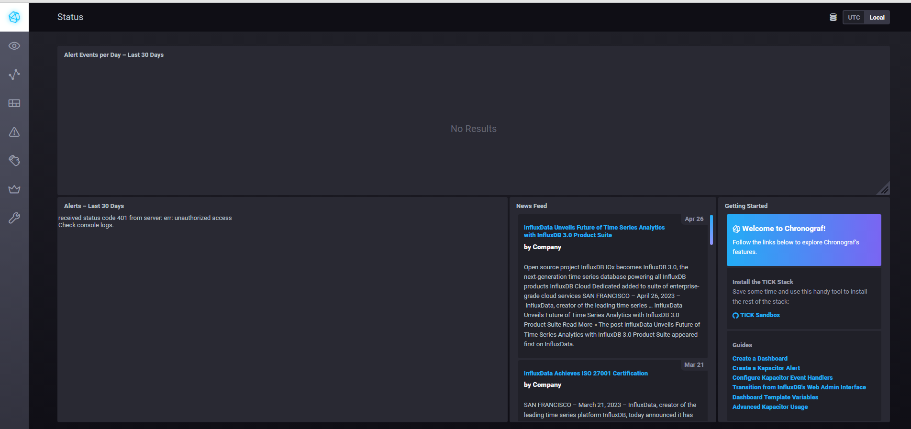

# Домашнее задание к занятию "13.Системы мониторинга"

## Обязательные задания

1. Вас пригласили настроить мониторинг на проект. На онбординге вам рассказали, что проект представляет из себя 
платформу для вычислений с выдачей текстовых отчетов, которые сохраняются на диск. Взаимодействие с платформой 
осуществляется по протоколу http. Также вам отметили, что вычисления загружают ЦПУ. Какой минимальный набор метрик вы
выведите в мониторинг и почему?

```
1. Производительность HTTP-сервера: Мониторинг количества запросов к серверу, среднего времени ответа, кодов ответа (например, 2xx - успешные, 5xx - ошибки сервера) и объема переданных данных. Это поможет отслеживать доступность и производительность платформы.

2. Доступное место на диске: Мониторинг свободного пространства на диске, на котором сохраняются текстовые отчёты. Это важно для предотвращения заполнения диска и возможных проблем с записью данных.

3. Нагрузка на ЦПУ: Мониторинг загрузки процессора позволит отслеживать, насколько интенсивно используется ЦПУ при проведении вычислений. Это поможет оптимизировать процессы и предотвратить возможные проблемы с производительностью.

4. Память: Мониторинг использования оперативной памяти поможет выявить утечки памяти или неэффективное использование ресурсов.

5. Логи и ошибки: Мониторинг журналов событий и ошибок поможет оперативно реагировать на проблемы и искать причины возможных сбоев в работе платформы.

```

#
2. Менеджер продукта посмотрев на ваши метрики сказал, что ему непонятно что такое RAM/inodes/CPUla. Также он сказал, 
что хочет понимать, насколько мы выполняем свои обязанности перед клиентами и какое качество обслуживания. Что вы 
можете ему предложить?

```

В данном случае метрики, которые уже установлены, предстваляют собой техническое состояние таких вещей, как:

- RAM -- Загрузка оперативной памяти
- inodes -- количество файловых дескрипторов, общее и использованное количество
- CPUla -- загрузка CPU по времени - 5,10,15 минут

Бизнесовой команде еще полезно навесить бизнесовые метрики, например:

1. Метрики доступности и надежности: Отслеживание доступности сервиса для клиентов, измерение времени простоя (downtime), а также мониторинг ошибок и сбоев. Эти метрики помогут понять, насколько стабильно работает платформа и какие проблемы возникают в процессе обслуживания.

2. Скорость ответа и производительность: Измерение времени отклика системы на запросы клиентов, скорости загрузки страниц и выполнения операций. Это позволит оценить производительность платформы и её способность обрабатывать запросы быстро.

3. Удовлетворенность клиентов: Сбор обратной связи от клиентов, опросы удовлетворенности и оценки качества обслуживания. Эти данные помогут понять, насколько клиенты довольны предоставляемыми услугами и выявить области для улучшения.

```

#
3. Вашей DevOps команде в этом году не выделили финансирование на построение системы сбора логов. Разработчики в свою 
очередь хотят видеть все ошибки, которые выдают их приложения. Какое решение вы можете предпринять в этой ситуации, 
чтобы разработчики получали ошибки приложения?

```

1. Использование стандартных лог-файлов: настроить приложение таким образом, чтобы все ошибки и предупреждения записывались в стандартные лог-файлы. Разработчики могут периодически проверять эти файлы для выявления проблем.

2. Использование инструментов мониторинга приложений: существует множество бесплатных инструментов, таких как ELK Stack (Elasticsearch, Logstash, Kibana), которые позволяют собирать и анализировать логи приложений. 

```

#
4. Вы, как опытный SRE, сделали мониторинг, куда вывели отображения выполнения SLA=99% по http кодам ответов. 
Вычисляете этот параметр по следующей формуле: summ_2xx_requests/summ_all_requests. Данный параметр не поднимается выше 
70%, но при этом в вашей системе нет кодов ответа 5xx и 4xx. Где у вас ошибка?

```
summ_2xx_requests/summ_all_requests

В этой формуле не учитаны коды ответов 1xx, и 3xx, что влияет на вычисляемый параметр SLA.
Правильная формула: (summ_1xx_requests+summ_2xx_requests+summ_3xx_requests)/summ_all_requests

```

#
5. Опишите основные плюсы и минусы pull и push систем мониторинга.

```
Push-система мониторинга:
Плюсы:
1. Простота настройки: агенты, установленные на мониторируемых устройствах, могут легко подключаться к центральному серверу для передачи данных.
2. Меньшая нагрузка на центральный сервер: так как агенты инициируют передачу данных, серверу не нужно постоянно опрашивать устройства.
3. Более гибкая конфигурация: агенты могут быть настроены для сбора различных типов данных и отправки их на сервер.

Минусы:
1. Большее потребление ресурсов на мониторируемых устройствах: агенты должны работать постоянно для передачи данных, что может вызвать дополнительную нагрузку.
2. Безопасность: агенты могут стать уязвимыми для атак или злоупотреблений, если не обеспечить их надлежащую защиту.

Pull-система мониторинга:
Плюсы:
1. Меньшее потребление ресурсов на мониторируемых устройствах: устройства не нужно постоянно работать для передачи данных.
2. Более безопасная система: центральный сервер инициирует передачу данных, что позволяет контролировать процесс передачи информации.

Минусы:
1. Большая нагрузка на центральный сервер: сервер должен постоянно опрашивать устройства для получения данных, что может привести к перегрузке.
2. Сложность настройки: требуется более сложная конфигурация для обеспечения корректной передачи данных от устройств к серверу.
```
#
6. Какие из ниже перечисленных систем относятся к push модели, а какие к pull? А может есть гибридные?

    - Prometheus 
    - TICK
    - Zabbix
    - VictoriaMetrics
    - Nagios

```
Prometheus - Pull модель: Prometheus использует pull-модель, где сервер Prometheus инициирует запросы к целевым устройствам для сбора метрик.

TICK - Push модель: В состав TICK (Telegraf, InfluxDB, Chronograf, Kapacitor) входит Telegraf, который собирает данные на устройствах и отправляет их в InfluxDB. Это сочетание представляет собой push-модель.

Zabbix - Push и Pull модель: Zabbix может работать как в режиме push (используя Zabbix агенты для передачи данных), так и в режиме pull (опрашивая устройства для получения данных).

VictoriaMetrics - Push модель: VictoriaMetrics также использует push-модель, где данные собираются на устройствах и передаются на сервер.

Nagios - Pull модель: Nagios работает по принципу pull, где сервер Nagios опрашивает устройства для получения данных о состоянии системы.
```
#
7. Склонируйте себе [репозиторий](https://github.com/influxdata/sandbox/tree/master) и запустите TICK-стэк, 
используя технологии docker и docker-compose.

В виде решения на это упражнение приведите скриншот веб-интерфейса ПО chronograf (`http://localhost:8888`). 

P.S.: если при запуске некоторые контейнеры будут падать с ошибкой - проставьте им режим `Z`, например
`./data:/var/lib:Z`



#
8. Перейдите в веб-интерфейс Chronograf (http://localhost:8888) и откройте вкладку Data explorer.
        
    - Нажмите на кнопку Add a query
    - Изучите вывод интерфейса и выберите БД telegraf.autogen
    - В `measurments` выберите cpu->host->telegraf-getting-started, а в `fields` выберите usage_system. Внизу появится график утилизации cpu.
    - Вверху вы можете увидеть запрос, аналогичный SQL-синтаксису. Поэкспериментируйте с запросом, попробуйте изменить группировку и интервал наблюдений.

Для выполнения задания приведите скриншот с отображением метрик утилизации cpu из веб-интерфейса.
#
9. Изучите список [telegraf inputs](https://github.com/influxdata/telegraf/tree/master/plugins/inputs). 
Добавьте в конфигурацию telegraf следующий плагин - [docker](https://github.com/influxdata/telegraf/tree/master/plugins/inputs/docker):
```
[[inputs.docker]]
  endpoint = "unix:///var/run/docker.sock"
```

Дополнительно вам может потребоваться донастройка контейнера telegraf в `docker-compose.yml` дополнительного volume и 
режима privileged:
```
  telegraf:
    image: telegraf:1.4.0
    privileged: true
    volumes:
      - ./etc/telegraf.conf:/etc/telegraf/telegraf.conf:Z
      - /var/run/docker.sock:/var/run/docker.sock:Z
    links:
      - influxdb
    ports:
      - "8092:8092/udp"
      - "8094:8094"
      - "8125:8125/udp"
```

После настройке перезапустите telegraf, обновите веб интерфейс и приведите скриншотом список `measurments` в 
веб-интерфейсе базы telegraf.autogen . Там должны появиться метрики, связанные с docker.

Факультативно можете изучить какие метрики собирает telegraf после выполнения данного задания.

## Дополнительное задание (со звездочкой*) - необязательно к выполнению

1. Вы устроились на работу в стартап. На данный момент у вас нет возможности развернуть полноценную систему 
мониторинга, и вы решили самостоятельно написать простой python3-скрипт для сбора основных метрик сервера. Вы, как 
опытный системный-администратор, знаете, что системная информация сервера лежит в директории `/proc`. 
Также, вы знаете, что в системе Linux есть  планировщик задач cron, который может запускать задачи по расписанию.

Суммировав все, вы спроектировали приложение, которое:
- является python3 скриптом
- собирает метрики из папки `/proc`
- складывает метрики в файл 'YY-MM-DD-awesome-monitoring.log' в директорию /var/log 
(YY - год, MM - месяц, DD - день)
- каждый сбор метрик складывается в виде json-строки, в виде:
  + timestamp (временная метка, int, unixtimestamp)
  + metric_1 (метрика 1)
  + metric_2 (метрика 2)
  
     ...
     
  + metric_N (метрика N)
  
- сбор метрик происходит каждую 1 минуту по cron-расписанию

Для успешного выполнения задания нужно привести:

а) работающий код python3-скрипта,

б) конфигурацию cron-расписания,

в) пример верно сформированного 'YY-MM-DD-awesome-monitoring.log', имеющий не менее 5 записей,

P.S.: количество собираемых метрик должно быть не менее 4-х.
P.P.S.: по желанию можно себя не ограничивать только сбором метрик из `/proc`.

2. В веб-интерфейсе откройте вкладку `Dashboards`. Попробуйте создать свой dashboard с отображением:

    - утилизации ЦПУ
    - количества использованного RAM
    - утилизации пространства на дисках
    - количество поднятых контейнеров
    - аптайм
    - ...
    - фантазируйте)
    
    ---

### Как оформить ДЗ?

Выполненное домашнее задание пришлите ссылкой на .md-файл в вашем репозитории.

---

